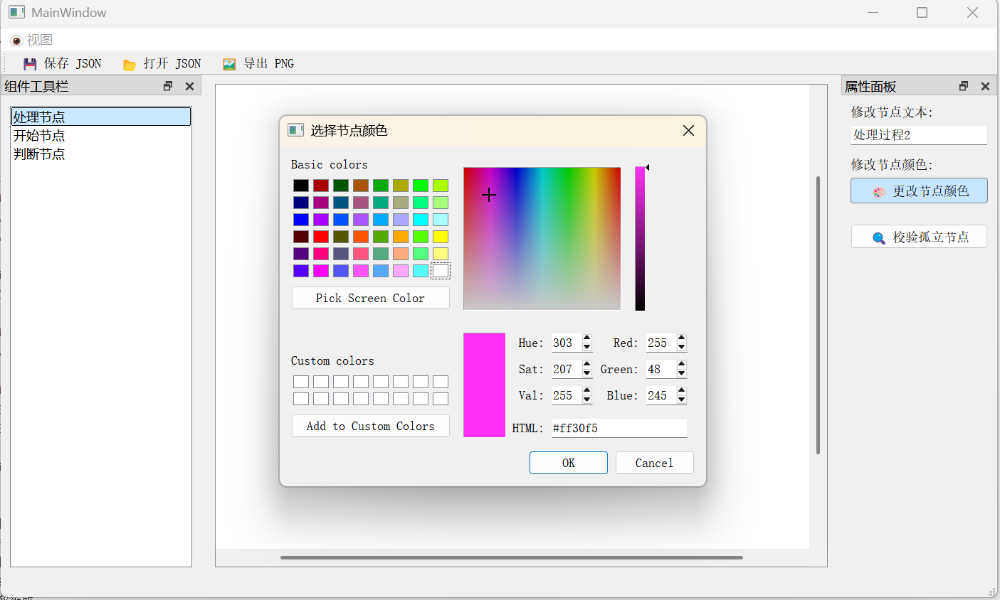
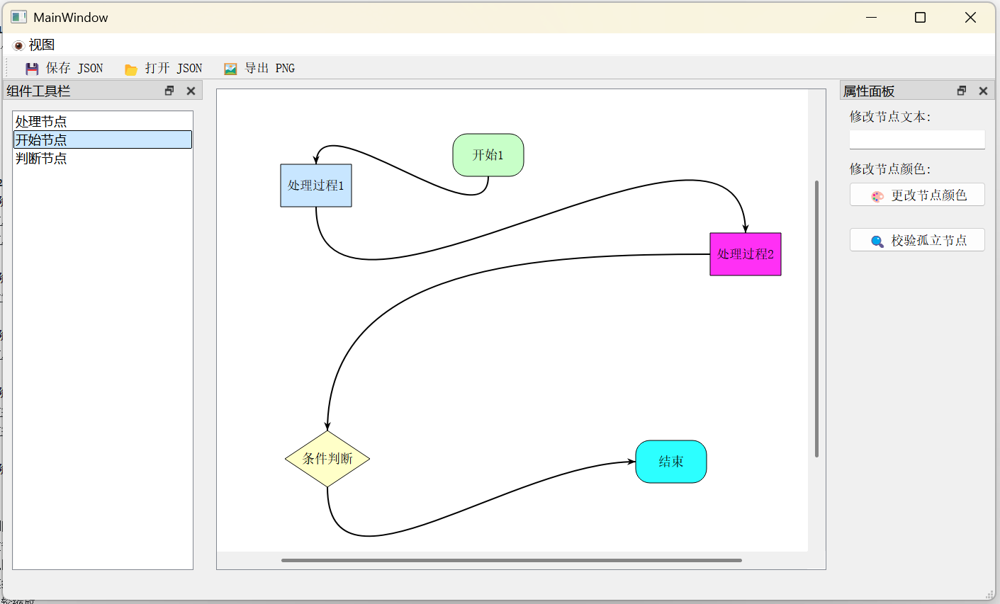
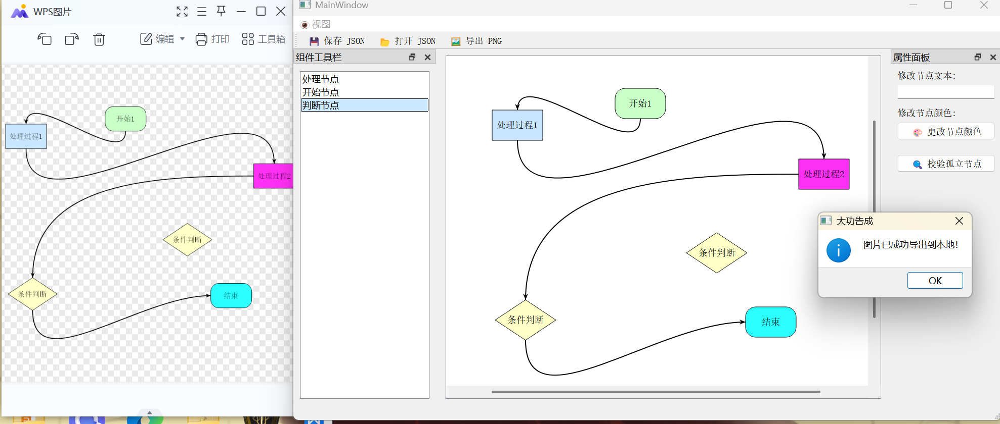

# FlowLite - 轻量级可视化流程建模工具
FlowLite 是一款基于 C++ 与 Qt 框架开发的桌面端轻量级流程图建模软件。本项目旨在提供一个集图形渲染、交互操作、逻辑校验于一体的可视化编程教学平台。通过面向对象的设计思想，实现了从基础图元绘制、高阶交互、历史记录管理到数据持久化的完整闭环。

## 1. 开发环境配置
为确保项目可正常编译与运行，请配置以下环境：
  * **开发语言**: C++ 11 (或更高)
  * **开发框架**: Qt 5.14.2 (使用 Widgets, Gui, Core 模块)
  * **IDE**: Qt Creator
  * **编译器**: MinGW 64-bit (GCC)
  * **构建工具**: qmake
### 运行环境搭建步骤
1. **克隆项目**：将本项目下载或 Clone 到本地目录，确保路径中无中文字符。
2. **加载工程**：打开 Qt Creator，点击 `文件` -> `打开文件或项目`，选择项目根目录下的 `FlowLite.pro` 文件。
3. **配置构建套件**：在弹出的项目配置页面，勾选你当前的 Desktop 构建套件（如 Desktop Qt 6.5.0 MinGW 64-bit），点击 `Configure Project`。
4. **编译与运行**：
    - 点击左下角的 🔨 图标（或按 `Ctrl+B`）进行项目构建。
    - 构建成功后，点击 ▶️ 图标（或按 `Ctrl+R`）运行项目。
  

## 2.当前实现程度（核心功能）
## 阶段一：基础架构与画布搭建（100%）
项目基于 Qt 框架完成了基础界面的全屏布局搭建，成功划分了左侧组件工具栏、中间核心画布区以及右侧属性面板。我们利用 QGraphicsScene 作为核心画布，接管了底层的逻辑坐标转换与视图重绘机制。此外，提取了面向对象的抽象基类 BaseNode，封装了位置、尺寸、颜色与文本等通用属性，为后续多态图元的开发奠定了坚实的架构基础

## 阶段二：图形绘制与交互（100%）
基于基类派生了 StartNode（圆角矩形）、ProcessNode（矩形）和 DecisionNode（菱形），并重写了底层绘制逻辑实现文本居中。通过拦截视图拖放事件，实现了从工具栏拖拽并在释放位置生成对应图形的功能。借助 Qt 图元特性，完美实现了节点的碰撞检测（hitTest）、平滑拖拽移动，并辅以蓝色边框作为高亮视觉反馈。

## 阶段三：连线与拓扑关系（100%）
为节点计算并隐藏了四个方位的锚点坐标，在节点选中时高亮渲染。封装了专门的 Connection 类负责维护连线的起止节点与锚点关系。在交互上，支持从源锚点拖出临时虚线，精确命中目标后生成带有空间方向感知的平滑贝塞尔实线。同时，实现了节点拖移时触发重绘，动态实时更新连线路径坐标的关键闭环。同时为直线添加了箭头确保流程图的可读性。

## 阶段四：数据存储与文件操作（100%）
项目打通了内存对象与本地文件的壁垒，实现了数据的持久化存储。通过设计结构化的 JSON 数据模型，我们将画布上的节点属性数组与连线关系数组进行了精确的序列化提取。配套开发了本地文件操作模块，不仅支持一键触发保存为标准的本地 JSON 文件，更能通过内置的字典池解析读取文件，完美重构并复原复杂的流程图拓扑结构。

## 阶段五：逻辑校验与完善（100%）
打通了右侧属性面板的数据双向绑定，监听选中事件实现节点数据的实时回显与动态修改。内置了专业的图论遍历算法，可一键检测全图，揪出缺乏出度或入度的非合规“孤立节点”并弹窗警告。最后，利用底层渲染接口将画布内容离屏绘制，实现了一键导出高清无损 PNG 图像的功能，满足了真实业务需求。

## 3.额外功能优化
一、删除功能
删除图元有 两种 触发方式：
1. 鼠标交互：选中节点后，右键点击呼出菜单，选择“🗑️ 删除选中项”。

2. 键盘交互（快捷键）：选中节点（或连线）后，直接按下键盘上的 Delete 键，或者 Backspace（退格键）。
   
二、撤销/重做
ctrl+z/ctrl+Y实现撤销和重做

三、视图
增加视图按钮集成左右左侧组件工具栏、右侧属性面板以及ctrl+z/ctrl+Y

四、滚轮缩放
鼠标放在对中间画布可以用滚轮缩放
